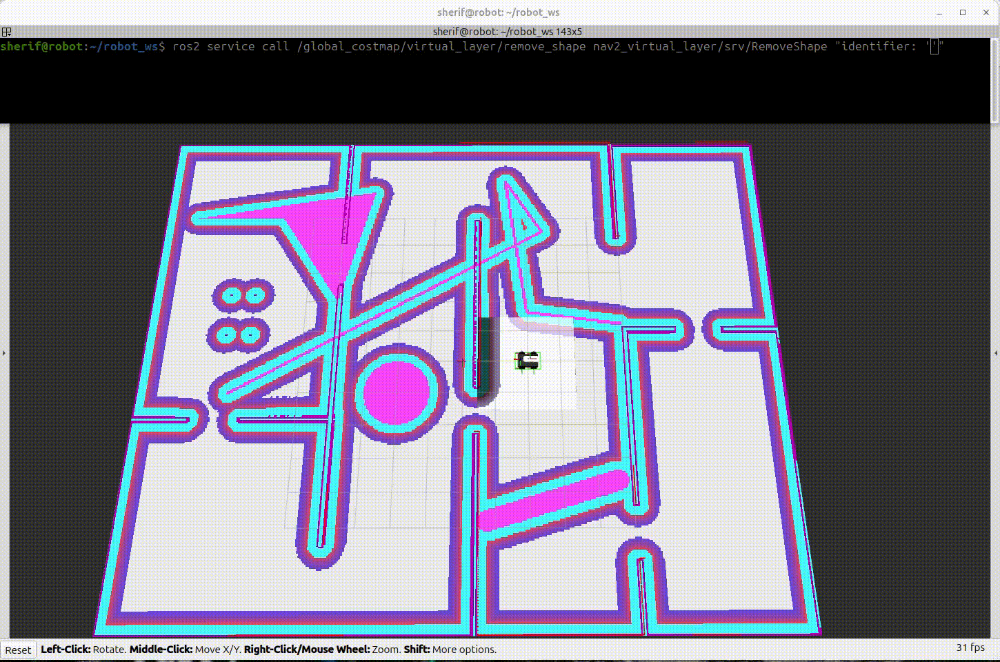
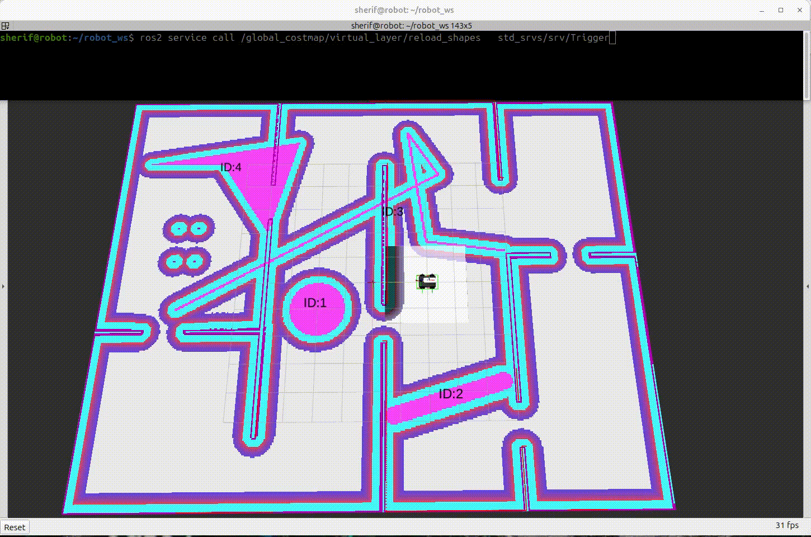

# nav2_virtual_layer

A Nav2 costmap layer plugin that dynamically creates **virtual obstacles and cost zones** using geometric shapes (circles, lines, polygons) with runtime configuration via services, topics, and YAML files.

[](https://docs.ros.org)
[](LICENSE)

---

## Overview

`nav2_virtual_layer` is a Nav2 costmap layer plugin that **allows you to define virtual obstacles and cost zones** using simple geometric shapes.

It provides **full control over the cost value of each shape**, enabling everything from soft cost regions to lethal obstacles.

The layer exposes **multiple runtime** services that allow you to **add, remove, clear, and restore shapes dynamically**, all **without restarting Nav2**.

## Demo


---

## Features

- ✅ **Geometric Shapes**: Circles, lines, and polygons
- ✅ **Flexible Polygons**: Filled or open (polyline) polygons
- ✅ **Cost Control**: Per-shape cost levels (1-254)
- ✅ **Time-Based Expiration**: Automatic removal after duration
- ✅ **Shape ID System**: Unique numeric IDs for easy management
- ✅ **Runtime Management**: Add/remove/clear shapes via services
- ✅ **Visual Feedback**: RViz2 marker visualization with shape IDs
- ✅ **TF-Aware**: Multi-frame support with automatic transformations
- ✅ **Thread-Safe**: Concurrent access protection
- ✅ **Multiple Input Methods**: YAML files, ROS parameters, services, and topics
- ✅ **Hot Reload**: Reload shapes from YAML without restart
- ✅ **Dual Costmap Support**: Works with **global_costmap** and **local_costmap**

---


## Installation

```bash
cd ~/ros2_ws/src
git clone https://github.com/sherif1152/nav2-virtual-layer.git
cd ~/ros2_ws
rosdep install --from-paths src --ignore-src -r -y
colcon build --packages-select nav2_virtual_layer
source install/setup.bash
```

---

## Quick Start

### Step 1: Enable the Plugin (Required)

The plugin can be used in **global_costmap**, **local_costmap**, or both.

#### Global Costmap Configuration

```yaml
global_costmap:
  global_costmap:
    ros__parameters:
      plugins:
        - static_layer
        - obstacle_layer
        - virtual_layer
        - inflation_layer

      virtual_layer:
        plugin: "nav2_virtual_layer::VirtualLayer"
        enabled: true
        map_frame: map
        default_cost_level: 254
        
        # ===============================
        # OPTION 1: Define shapes inline
        # ===============================
        # forms:
        #   - "CIRCLE(2 3 0.5) [COST:254] [ID:1]"
        #   - "LINESTRING(0 0, 5 5) [COST:200] [THICKNESS:0.3] [ID:2]"
        #   - "POLYGON((), 1 1, 4 1, 4 4, 1 4) [COST:128] [ID:3]"

        # ==================================
        # OPTION 2: Load shapes from a file
        # ==================================
        forms_file: "package://my_robot_nav/config/virtual_layer_forms.yaml"
        
        # 👉 You can use OPTION 1 OR OPTION 2
        # 👉 Only ONE source is used
```

<details>
<summary><strong>Example 1: Define shapes inline (OPTION 1)</strong></summary>

```yaml
global_costmap:
  global_costmap:
    ros__parameters:
      plugins:
        - static_layer
        - obstacle_layer
        - virtual_layer
        - inflation_layer

      virtual_layer:
        plugin: "nav2_virtual_layer::VirtualLayer"
        enabled: true
        map_frame: map
        default_cost_level: 254
        
        enable_visualization: true
        visualization_rate: 2.0

        forms:
          - "CIRCLE(2 3 0.5) [COST:254] [ID:1]"
          - "LINESTRING(0 0, 5 5) [COST:200] [THICKNESS:0.3] [ID:2]"
          - "POLYGON((1 1, 4 1, 4 4, 1 4)) [COST:128] [ID:3]"
```

</details>

<details>
<summary><strong>Example 2: Load shapes from file (OPTION 2)</strong></summary>

**Using package:// URI:**
```yaml
virtual_layer:
  plugin: "nav2_virtual_layer::VirtualLayer"
  enabled: true
  map_frame: map
  default_cost_level: 254
  
  enable_visualization: true

  forms_file: "package://my_robot_nav/config/virtual_layer_forms.yaml"
```

**Using absolute path:**
```yaml
virtual_layer:
  plugin: "nav2_virtual_layer::VirtualLayer"
  enabled: true
  map_frame: map
  default_cost_level: 254

  forms_file: "/home/user/robot_ws/src/my_robot_nav/config/virtual_layer_forms.yaml"
```

</details>

---

✅ `forms_file` is recommended for large projects


#### Expected Output

When the `virtual_layer` plugin is loaded with a `forms_file`, you'll see:

```
[planner_server-4] [INFO] [timestamp] [global_costmap.global_costmap]: Using plugin "virtual_layer"
[planner_server-4] [INFO] [timestamp] [global_costmap.global_costmap.virtual_layer]: Loading forms from external YAML: /path/to/virtual_layer_forms.yaml
[planner_server-4] [INFO] [timestamp] [global_costmap.global_costmap.virtual_layer]: Reading forms from: /path/to/virtual_layer_forms.yaml
[planner_server-4] [INFO] [timestamp] [global_costmap.global_costmap.virtual_layer]: Found 4 forms in YAML file
[planner_server-4] [INFO] [timestamp] [global_costmap.global_costmap.virtual_layer]: Added CIRCLE [ID:1]: x=2.00 y=1.00 r=1.00 cost=254 duration=20.0s
[planner_server-4] [INFO] [timestamp] [global_costmap.global_costmap.virtual_layer]: Added LINESTRING [ID:2]: (-0.77,4.80)->(-4.60,3.65) thick=0.50 cost=254 duration=20.0s
[planner_server-4] [INFO] [timestamp] [global_costmap.global_costmap.virtual_layer]: Added POLYGON [ID:3]: 5 points open cost=254 duration=infinite
[planner_server-4] [INFO] [timestamp] [global_costmap.global_costmap.virtual_layer]: Added POLYGON [ID:4]: 4 points filled cost=250 duration=infinite
[planner_server-4] [INFO] [timestamp] [global_costmap.global_costmap.virtual_layer]: Successfully loaded: 1 circles, 1 lines, 2 polygons
[planner_server-4] [INFO] [timestamp] [global_costmap.global_costmap.virtual_layer]: Visualization enabled at 2.0 Hz
[planner_server-4] [INFO] [timestamp] [global_costmap.global_costmap.virtual_layer]: VirtualLayer initialized: 1 circles, 1 lines, 2 polygons
[planner_server-4] [INFO] [timestamp] [global_costmap.global_costmap]: Initialized plugin "virtual_layer"
```

---

#### Optional: Enable Also in Local Costmap

```yaml
local_costmap:
  local_costmap:
    ros__parameters:
      plugins:
        - obstacle_layer
        - virtual_layer
        - inflation_layer

      virtual_layer:
        plugin: "nav2_virtual_layer::VirtualLayer"
        enabled: true
        map_frame: map
        enable_visualization: true
```

📌 Same configuration style applies

---

### Step 2: Create External Shapes File

Create an external YAML file to define virtual shapes:

- #### 📄 File: `config/virtual_layer_forms.yaml`

  ```yaml
  # config/virtual_layer_forms.yaml
  forms:
    # ========================================
    # CIRCLES
    # ========================================
    # Format: CIRCLE(x y radius) [COST:value] [DURATION:seconds] [ID:number]
    
    # Permanent lethal circular obstacle
    - CIRCLE(5 -2 1.5) [COST:254] [ID:1]
    
    # Temporary circular zone (expires after 30 seconds)
    - CIRCLE(2 3 1.0) [COST:200] [DURATION:30] [ID:2]

    # ========================================
    # LINES
    # ========================================
    # Format: LINESTRING(x1 y1, x2 y2) [COST:value] [THICKNESS:value] [DURATION:seconds] [ID:number]
    
    # Permanent line barrier
    - LINESTRING(0 0, 10 0) [COST:254] [THICKNESS:0.4] [ID:10]
    
    # Temporary thin line (expires after 60 seconds)
    - LINESTRING(-5 5, 5 5) [COST:200] [THICKNESS:0.2] [DURATION:60] [ID:11]

    # ========================================
    # FILLED POLYGONS
    # ========================================
    # Format: POLYGON((), x1 y1, x2 y2, ...) [COST:value] [DURATION:seconds] [ID:number]
    
    # Permanent filled rectangle
    - POLYGON((), 0 0, 4 0, 4 3, 0 3) [COST:254] [ID:20]
    
    # Temporary filled triangle (expires after 45 seconds)
    - POLYGON((), -2 -2, 0 2, 2 -2) [COST:128] [DURATION:45] [ID:21]

    # ========================================
    # OPEN POLYGONS (Polylines)
    # ========================================
    # Format: POLYGON(x1 y1, x2 y2, ...) [COST:value] [DURATION:seconds] [ID:number]
    
    # Permanent open polygon boundary
    - POLYGON(6 0, 8 0, 8 4, 6 4) [COST:200] [ID:30]
    
    # Temporary polyline path (expires after 20 seconds)
    - POLYGON(-3 -3, -1 -1, 1 -3, 3 -1) [COST:150] [DURATION:20] [ID:31]
  ```

**Notes:**
- `[ID:n]` is **optional** - if omitted, IDs are auto-assigned
- `[DURATION:n]` - shapes expire after n seconds; omit for permanent shapes
- `[COST:n]` - ranges from 1 (low) to 254 (lethal); omit to use `default_cost_level`
- `[THICKNESS:n]` - only for lines, omit to use `line_thickness` parameter

---

### Step 3: Launch Nav2

```bash
ros2 launch my_robot_nav navigation_launch.py
```

---

## Configuration Parameters

| Parameter                      | Type     | Default | Description                                    |
| ------------------------------ | -------- | ------- | ---------------------------------------------- |
| `enabled`                      | bool     | `true`  | Enable/disable the layer                       |
| `map_frame`                    | string   | `map`   | Default coordinate frame for shapes            |
| `line_thickness`               | double   | `0.3`   | Default thickness for lines (meters)           |
| `default_cost_level`           | int      | `254`   | Default cost when not specified                |
| `expiration_check_frequency`   | double   | `1.0`   | Rate to check for expired shapes (Hz)          |
| `enable_visualization`         | bool     | `true`  | Enable RViz2 marker visualization              |
| `visualization_rate`           | double   | `2.0`   | Rate to publish visualization markers (Hz)     |
| `text_height`                  | double   | `0.5`   | Height of ID text markers (meters)             |
| `text_color_r`                 | double   | `0.0`   | Red component of text color (0.0-1.0)          |
| `text_color_g`                 | double   | `0.0`   | Green component of text color (0.0-1.0)        |
| `text_color_b`                 | double   | `0.0`   | Black component of text color (0.0-1.0)        |
| `text_color_a`                 | double   | `1.0`   | Alpha (transparency) of text (0.0-1.0)         |
| `forms`                        | string[] | `[]`    | Inline WKT shape definitions                   |
| `forms_file`                   | string   | `""`    | Path to external YAML file with shapes         |

---

## Shape Definitions

- ### Circle

  ```
  CIRCLE(x y radius) [COST:n] [DURATION:seconds] [ID:number]
  ```

  - **Example:**
    ```yaml
    - "CIRCLE(5.0 3.2 1.5) [COST:254] [DURATION:60] [ID:1]"
    ```

- ### Line

  ```
  LINESTRING(x1 y1, x2 y2) [COST:n] [THICKNESS:t] [DURATION:seconds] [ID:number]
  ```

  - **Example:**
    ```yaml
    - "LINESTRING(0 0, 10 5) [COST:200] [THICKNESS:0.5] [ID:10]"
    ```

- ### Filled Polygon

  ```
  POLYGON((), x1 y1, x2 y2, x3 y3, ...) [COST:n] [DURATION:seconds] [ID:number]
  ```

  - **Example:**
    ```yaml
    - "POLYGON((), 0 0, 4 0, 4 4, 0 4) [COST:254] [ID:20]"
    ```

- ### Open Polygon (Polyline)

  ```
  POLYGON(x1 y1, x2 y2, x3 y3, ...) [COST:n] [DURATION:seconds] [ID:number]
  ```

  - **Example:**
    ```yaml
    - "POLYGON(1 1, 3 1, 3 3, 1 3) [COST:180] [ID:30]"
    ```


---

## Cost Levels

| Cost | Meaning         |
| ---- | --------------- |
| 254  | LETHAL_OBSTACLE |
| 253  | INSCRIBED       |
| 200  | High cost       |
| 128  | Medium cost     |
| 1–50 | Low cost        |

**Notes:**
- ➡ **Highest cost always wins** when shapes overlap
- ➡ Costs **merge** with existing costmap (inflation, obstacles, etc.)
- ➡ Use cost gradients to create soft boundaries and priority zones


---

## Runtime Management

All services exist under both:
- `/global_costmap/virtual_layer/...`
- `/local_costmap/virtual_layer/...`

## 🛠 VirtualLayer Services

| Service Name                      | Service Type                         | Description                                                      | Request Fields                                                         | Response Fields                  |
| --------------------------------- | ------------------------------------ | ---------------------------------------------------------------- | ---------------------------------------------------------------------- | -------------------------------- |
| `/virtual_layer/add_circle`       | `nav2_virtual_layer/srv/AddCircle`   | Add a circular virtual obstacle                                  | `x`, `y`, `radius`, `frame_id`, `cost_level`, `duration`, `shape_id`   | `uuid`, `shape_id`, `success`    |
| `/virtual_layer/add_line`         | `nav2_virtual_layer/srv/AddLine`     | Add a line virtual obstacle                                      | `x1`, `y1`, `x2`, `y2`, `thickness`, `frame_id`, `cost_level`, `duration`, `shape_id` | `uuid`, `shape_id`, `success`    |
| `/virtual_layer/add_polygon`      | `nav2_virtual_layer/srv/AddPolygon`  | Add a polygon virtual obstacle                                   | `points[]`, `frame_id`, `cost_level`, `duration`, `shape_id`           | `uuid`, `shape_id`, `success`    |
| `/virtual_layer/remove_shape`     | `nav2_virtual_layer/srv/RemoveShape` | Remove shape by UUID or numeric ID                               | `identifier` (UUID string or numeric ID as string)                     | `success`, `message`             |
| `/virtual_layer/clear_all`        | `std_srvs/srv/Trigger`               | Remove all virtual shapes                                        | —                                                                      | `success`, `message`             |
| `/virtual_layer/restore_defaults` | `std_srvs/srv/Trigger`               | Clear all and reload from parameters/file                        | —                                                                      | `success`, `message`             |
| `/virtual_layer/reload_shapes`    | `std_srvs/srv/Trigger`               |  Reload shapes from YAML file without restart            | —                                                                      | `success`, `message`             |

---

## Service Examples

- ### Add Circle

  ```bash
  ros2 service call /global_costmap/virtual_layer/add_circle \
    nav2_virtual_layer/srv/AddCircle \
    "{x: -7.0, y: -4.0, radius: 1.0, cost_level: 254, duration: 30.0}"
  ```

  **Response:**
  ```
  uuid: "a1b2c3d4-e5f6-7890-abcd-ef1234567890"
  shape_id: 42
  success: true
  ```

- ### Add Line

  ```bash
  ros2 service call /global_costmap/virtual_layer/add_line \
    nav2_virtual_layer/srv/AddLine \
    "{x1: 0, y1: -5, x2: 4, y2: -5, thickness: 0.3, cost_level: 254, duration: 0}"
  ```

- ### Add Polygon 

  ```bash
  ros2 service call /global_costmap/virtual_layer/add_polygon \
    nav2_virtual_layer/srv/AddPolygon \
    "{points: [{x: 1, y: -1}, {x: 3, y: -1}, {x: 3, y: 2}, {x: 1, y: 2}], 
      cost_level: 254, 
      duration: 10.0}"
  ```
  
  ---

- ### Remove Shape (by ID or UUID)

  - **By numeric ID:**
    ```bash
    ros2 service call /global_costmap/virtual_layer/remove_shape \
      nav2_virtual_layer/srv/RemoveShape \
      "{identifier: '42'}"
    ```
    

  - **By UUID:**
    ```bash
    ros2 service call /global_costmap/virtual_layer/remove_shape \
      nav2_virtual_layer/srv/RemoveShape \
      "{identifier: 'a1b2c3d4-e5f6-7890-abcd-ef1234567890'}"
    ```
    
    ---


- ### Clear All Shapes

  ```bash
  ros2 service call /global_costmap/virtual_layer/clear_all \
    std_srvs/srv/Trigger
  ```

- ### Restore Default Shapes

  ```bash
  ros2 service call /global_costmap/virtual_layer/restore_defaults \
    std_srvs/srv/Trigger
  ```

  

  ---

- ### Reload Shapes from YAML

  ```bash
  ros2 service call /global_costmap/virtual_layer/reload_shapes \
    std_srvs/srv/Trigger
  ```

  

  #### ⚠️ Important Note About `forms_file`

  The behavior of `/reload_shapes` depends on how the `forms_file` path is defined:

  -  **Using absolute path (Recommended during development):**

      ```yaml
      forms_file: "/home/sherif/robot_ws/src/rahal_navigation/config/virtual_layer_forms.yaml"
      ```
      - Changes are applied immediately.
      - No need to run `colcon build`.

  - **Using `package://` URI:**

      ```yaml
      forms_file: "package://rahal_navigation/config/virtual_layer_forms.yaml"
      ```

    - Requires running `colcon build` after modifying the YAML file.

    ---

## Topic Examples

The virtual_layer subscribes to `/virtual_layer/shapes` for dynamic WKT additions.

- ### Add Circle via Topic

  ```bash
  ros2 topic pub --once \
    /global_costmap/virtual_layer/shapes std_msgs/msg/String \
    "{data: 'CIRCLE(1.5 5.5 0.8) [COST:254] [ID:100]'}"
  ```

- ### Add Line via Topic

  ```bash
  ros2 topic pub --once \
    /global_costmap/virtual_layer/shapes std_msgs/msg/String \
    "{data: 'LINESTRING(-1 -2, -5 -5) [COST:254] [THICKNESS:0.3] [DURATION:30] [ID:101]'}"
  ```

- ### Add Open Polygon via Topic

  ```bash
  ros2 topic pub --once \
    /global_costmap/virtual_layer/shapes std_msgs/msg/String \
    "{data: 'POLYGON(0 0, 4 0, 4 4, 0 4) [COST:254] [ID:102]'}"
  ```

- ### Add Filled Polygon via Topic

  ```bash
  ros2 topic pub --once \
    /global_costmap/virtual_layer/shapes std_msgs/msg/String \
    "{data: 'POLYGON((), 0 0, 4 0, 4 -4, 0 -4) [COST:254] [ID:103]'}"
  ```

  

**Note:** IDs specified in topic messages are honored if available, otherwise auto-assigned.

---

## Visualization in RViz2

When `enable_visualization: true`, the plugin publishes shape ID markers to `/virtual_layer/shape_markers`.

### Setup RViz2

1. Add **MarkerArray** display
2. Set topic to `/global_costmap/virtual_layer/shape_markers`
3. Shape IDs will appear as text labels above each obstacle

### Marker Details

- **Circles**: ID displayed at center
- **Lines**: ID displayed at midpoint
- **Polygons**: ID displayed at centroid
- **Update Rate**: Controlled by `visualization_rate` parameter
- **Appearance**: Customizable via `text_height` and `text_color_*` parameters

---

## Shape Expiration

### Expected Output

When shapes with finite `[DURATION]` expire:

```
[planner_server-4] [DEBUG] [timestamp] [global_costmap.virtual_layer]: Circle [ID:1, UUID:abc123] expired after 30.0 seconds
[planner_server-4] [DEBUG] [timestamp] [global_costmap.virtual_layer]: Line [ID:2, UUID:def456] expired after 30.0 seconds
[planner_server-4] [INFO] [timestamp] [global_costmap.virtual_layer]: Removed expired CIRCLE [ID:1, UUID:abc123]
[planner_server-4] [INFO] [timestamp] [global_costmap.virtual_layer]: Removed expired LINE [ID:2, UUID:def456]
[planner_server-4] [INFO] [timestamp] [global_costmap.virtual_layer]: Removed 2 expired shape(s)
```

### Behavior

- Expiration checks run at `expiration_check_frequency` (default: 1 Hz)
- Shapes with `duration < 0` or `duration == 0` persist forever
- Infinite-duration shapes are skipped efficiently (no overhead)
- Expired shapes are automatically removed from costmap

---

## Notes and Edge Cases

### Parameter Defaults

- Missing `[COST]` tag → uses `default_cost_level`
- Missing `[THICKNESS]` tag → uses `line_thickness` parameter
- Missing `[DURATION]` tag → shape persists forever
- Missing `[ID]` tag → auto-assigns next available ID
- Negative or zero `duration` → infinite lifetime

### Shape Requirements

- **Polygons**: Need ≥ 3 points
- **Lines**: Need exactly 2 points
- **Circles**: Require positive radius

### Edge Cases

- **TF failures**: Shapes in unreachable frames are safely skipped
- **Overlapping shapes**: Highest cost value wins at each cell
- **ID conflicts**: Requested IDs are honored if available, else auto-assigned
- **Duplicate UUIDs**: Internal UUID conflicts are impossible (UUID v4 generation)
- **Hot reload failures**: YAML file must exist and be valid

### Performance

- Expiration checks: O(n) where n = number of shapes with finite duration
- Infinite shapes: Skipped during expiration (O(1) check per shape)
- TF lookups: Cached by tf2 for performance
- Thread safety: Mutex-protected shape containers

---


## References

This package was inspired by and builds upon the following resources:

### Related Work

- **[virtual_costmap_layer (ROS 1)](https://github.com/GMahmoud/virtual_costmap_layer/tree/feature-big-refactoring)** - Original ROS 1 implementation by GMahmoud that provided the foundational concept of virtual costmap layers with geometric primitives

### Official Documentation

- **[Nav2 Costmap Plugin Tutorial](https://docs.nav2.org/plugin_tutorials/docs/writing_new_costmap2d_plugin.html)** - Official Nav2 documentation for creating custom costmap plugins
- **[Nav2 Costmap 2D Package](https://github.com/ros-planning/navigation2/tree/main/nav2_costmap_2d)** - Core Nav2 costmap implementation
- **[ROS 2 Pluginlib](https://docs.ros.org/en/jazzy/Tutorials/Beginner-Client-Libraries/Pluginlib.html)** - Plugin architecture used by Nav2

### Additional Resources

- **[Well-Known Text (WKT)](https://en.wikipedia.org/wiki/Well-known_text_representation_of_geometry)** - Geometry representation format used for shape definitions
- **[Nav2 Documentation](https://docs.nav2.org/)** - Complete Navigation2 documentation

### Acknowledgments

Special thanks to the Nav2 team and the ROS community for their excellent documentation and tools that made this plugin possible.

---

<div align="center">

**Made with ❤️ for the Robotics Community**

</div>