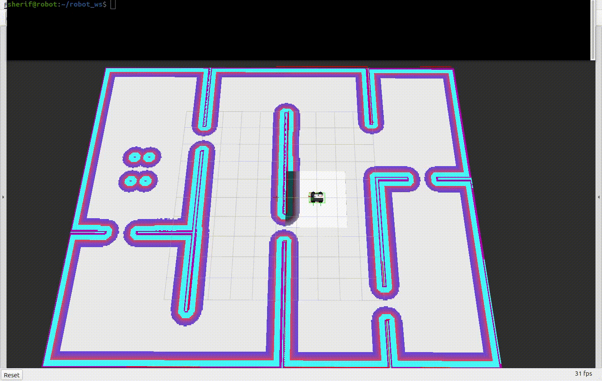
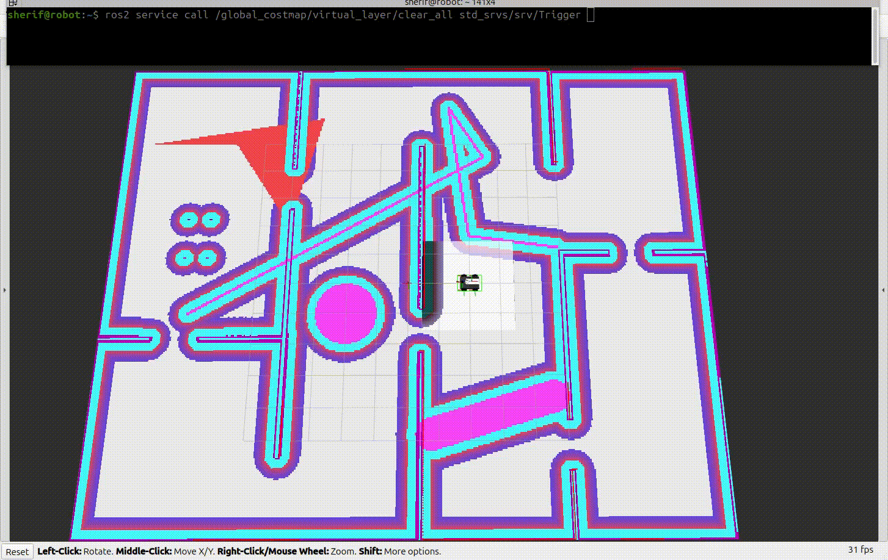
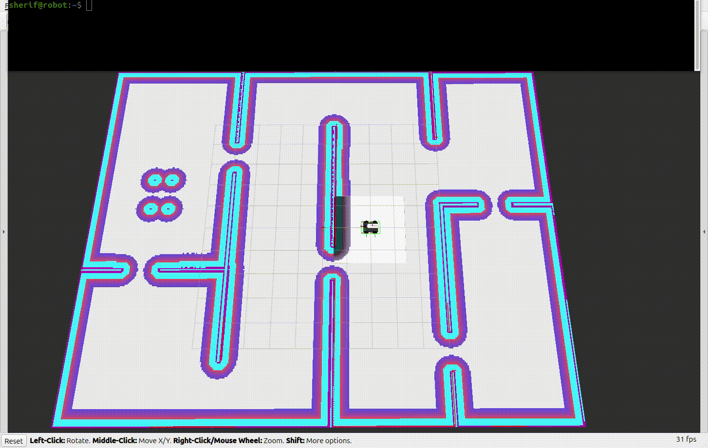

# nav2_virtual_layer

A Nav2 costmap layer plugin that dynamically creates **virtual obstacles and cost zones** using geometric shapes (circles, lines, polygons) with runtime configuration via services, topics, and YAML files.

[](https://docs.ros.org)
[](LICENSE)

---

## Overview

`nav2_virtual_layer` is a Nav2 costmap layer plugin that **allows you to define virtual obstacles and cost zones** using simple geometric shapes.

It provides **full control over the cost value of each shape**, enabling everything from soft cost regions to lethal obstacles.

The layer exposes **multiple runtime** services that allow you to **add, remove, clear, and restore shapes dynamically**, all **without restarting Nav2**.

## Demo


---

## Features

- ✅ Circles, lines, and polygons
- ✅ Filled or open polygons
- ✅ Per-shape cost levels
- ✅ Runtime add/remove/clear
- ✅ TF-aware (frame-safe)
- ✅ Thread-safe
- ✅ YAML, parameters, services, and topics
- ✅ Works with **global_costmap** and **local_costmap**

---

## Installation

```bash
cd ~/ros2_ws/src
git clone https://github.com/sherif1152/nav2-virtual-layer.git
cd ~/ros2_ws
rosdep install --from-paths src --ignore-src -r -y
colcon build --packages-select nav2_virtual_layer
source install/setup.bash
```

---

## Quick Start

### Step 1: Enable the Plugin (Required)

The plugin can be used in **global_costmap**, **local_costmap**, or both.


- ### Global Costmap

  ```yaml
  global_costmap:
    global_costmap:
      ros__parameters:
        plugins:
          - static_layer
          - obstacle_layer
          - virtual_layer
          - inflation_layer

        virtual_layer:
          plugin: "nav2_virtual_layer::VirtualLayer"
          enabled: true
          map_frame: map
          default_cost_level: 254

          # ===============================
          # OPTION 1: Define shapes inline
          # ===============================
          # forms:
          #   - "CIRCLE(2 3 0.5) [COST:254]"
          #   - "LINESTRING(0 0, 5 5) [COST:200] [THICKNESS:0.3]"
          #   - "POLYGON((), 1 1, 4 1, 4 4, 1 4) [COST:128]"

          # ==================================
          # OPTION 2: Load shapes from a file
          # ==================================
          # forms_file: "package://my_robot_nav/config/virtual_layer_forms.yaml"

          # 👉 You can use OPTION 1 OR OPTION 2
          # 👉 If forms_file is set, it OVERRIDES forms
          # 👉 Only ONE source is used
  ```

  <details>
   <summary> <strong> Example 1: Define shapes inline (OPTION 1)</strong> </summary>

  ```yaml
  global_costmap:
    global_costmap:
      ros__parameters:
        plugins:
          - static_layer
          - obstacle_layer
          - virtual_layer
          - inflation_layer

        virtual_layer:
          plugin: "nav2_virtual_layer::VirtualLayer"
          enabled: true
          map_frame: map
          default_cost_level: 254

          forms:
            - "CIRCLE(2 3 0.5) [COST:254]"
            - "LINESTRING(0 0, 5 5) [COST:200] [THICKNESS:0.3]"
            - "POLYGON((1 1, 4 1, 4 4, 1 4)) [COST:128]"
  ```

  </details>

  <details>
  <summary> <strong> Example 2: Load shapes from file (OPTION 2) </strong></summary>

  ```yaml
  global_costmap:
    global_costmap:
      ros__parameters:
        plugins:
          - static_layer
          - obstacle_layer
          - virtual_layer
          - inflation_layer

        virtual_layer:
          plugin: "nav2_virtual_layer::VirtualLayer"
          enabled: true
          map_frame: map
          default_cost_level: 254

          forms_file: "package://my_robot_nav/config/virtual_layer_forms.yaml"
  ```

  ```yaml
  virtual_layer:
    plugin: "nav2_virtual_layer::VirtualLayer"
    enabled: true
    map_frame: map
    default_cost_level: 254

    forms_file: "/home/user/robot_ws/src/my_robot_nav/config/virtual_layer_forms.yaml"
  ```

  </details>

  ***

  ✅ `forms_file` is recommended for large projects

  ✅ Expected Output

  When the `virtual_layer` plugin is loaded and a `forms_file` is provided, the output will be:

  <pre style="font-size: 12px;">
    [planner_server-4] [INFO] [1767520773.180575298] [global_costmap.global_costmap]: Using plugin "virtual_layer"
    [planner_server-4] [INFO] [1767520773.185109413] [global_costmap.global_costmap]: Loading forms from external YAML: /home/sherif/robot_ws/install/rahal_navigation/share/rahal_navigation/config/virtual_layer_forms.yaml
    [planner_server-4] [INFO] [1767520773.185159928] [global_costmap.global_costmap]: Reading forms from: /home/sherif/robot_ws/install/rahal_navigation/share/rahal_navigation/config/virtual_layer_forms.yaml
    [planner_server-4] [INFO] [1767520773.185251680] [global_costmap.global_costmap]: Found 4 forms in YAML file
    [planner_server-4] [INFO] [1767520773.185656156] [global_costmap.global_costmap]: Added CIRCLE [b6de4856-cd1c-4850-8cac-d98ee5b7bbaf]: x=2.00, y=1.00, r=1.00, cost=254
    [planner_server-4] [INFO] [1767520773.186112104] [global_costmap.global_costmap]: Added LINESTRING [c7a3f5d8-c85b-40bb-ac94-153a317bb872]: (-0.77,4.80) to (-4.60,3.65), thickness=0.50, cost=254
    [planner_server-4] [INFO] [1767520773.186524269] [global_costmap.global_costmap]: Added POLYGON [c4c1eaf9-7fc7-464d-a4d3-df25e2582c61]: 5 points, open, cost=254
    [planner_server-4] [INFO] [1767520773.186623862] [global_costmap.global_costmap]: Added POLYGON [6de4fec7-8a2d-4a57-9f45-758d2e150338]: 4 points, filled, cost=250
    [planner_server-4] [INFO] [1767520773.186668859] [global_costmap.global_costmap]: Successfully loaded: 1 circles, 1 lines, 2 polygons
    [planner_server-4] [INFO] [1767520773.194889738] [global_costmap.global_costmap]: VirtualLayer initialized: 1 circles, 1 lines, 2 polygons
    [planner_server-4] [INFO] [1767520773.194949434] [global_costmap.global_costmap]: Initialized plugin "virtual_layer"
    
  </pre>

  ---

- ### Optional: Enable Also in Local Costmap

  ```yaml
  local_costmap:
    local_costmap:
      ros__parameters:
        plugins:
          - obstacle_layer
          - virtual_layer
          - inflation_layer

        virtual_layer:
          plugin: "nav2_virtual_layer::VirtualLayer"
          enabled: true
          map_frame: map
  ```

  📌 Same configuration style

---

### Step 2: Example External Shapes File

Create an external YAML file to define virtual shapes that will be loaded by the virtual_layer plugin.

- ### 📄 File: config/virtual_layer_forms.yaml

  ```yaml
  # config/virtual_layer_forms.yaml
  forms:
    # A circular virtual obstacle
    # Format: CIRCLE(x y radius) [COST:value]
    - CIRCLE(5 -2 1.5) [COST:254]

    # A virtual line obstacle
    # Format: LINESTRING(x1 y1, x2 y2) [COST:value] [THICKNESS:value]
    - LINESTRING(0 0, 10 0) [COST:200] [THICKNESS:0.4]

    # A polygonal virtual obstacle
    # Format: POLYGON(x1 y1, x2 y2, x3 y3, ...) [COST:value]
    # The polygon can be open or filled depending on the definition
    - POLYGON(0 0, 4 0, 4 3, 0 3) [COST:254]
  ```

---

### Step 3: Launch Nav2

```bash
ros2 launch my_robot_nav navigation_launch.py
```

---

## Configuration

| Parameter            | Type     | Default | Description              |
| -------------------- | -------- | ------- | ------------------------ |
| `enabled`            | bool     | `true`  | Enable the layer         |
| `map_frame`          | string   | `map`   | Default coordinate frame |
| `line_thickness`     | double   | `0.3`   | Default line thickness   |
| `default_cost_level` | int      | `254`   | Default cost             |
| `forms`              | string[] | `[]`    | Inline WKT shapes        |
| `forms_file`         | string   | `""`    | External YAML file       |

---

## Shape Definitions

- ### Circle

  ```yaml
  CIRCLE(x y radius) [COST:n]
  ```

- ### Line

  ```yaml
  LINESTRING(x1 y1, x2 y2) [COST:n] [THICKNESS:t]
  ```

- ### Filled Polygon

  ```yaml
  POLYGON((), x1 y1, x2 y2, x3 y3) [COST:n]
  ```

- ### Open Polygon (Polyline)

  ```yaml
  POLYGON(x1 y1, x2 y2, x3 y3) [COST:n]
  ```

---

## Cost Levels

| Cost | Meaning         |
| ---- | --------------- |
| 254  | LETHAL_OBSTACLE |
| 253  | INSCRIBED       |
| 200  | High cost       |
| 128  | Medium cost     |
| 1–50 | Low cost        |

➡ Highest cost always wins

➡ Costs merge with existing costmap


---

## Runtime Management

All services exist in:

- `/global_costmap/virtual_layer/...`
- `/local_costmap/virtual_layer/...`

## 🛠 VirtualLayer Services

| Service Name                      | Service Type                         | Description                                                      | Request Fields                                                | Response Fields      |
| --------------------------------- | ------------------------------------ | ---------------------------------------------------------------- | ------------------------------------------------------------- | -------------------- |
| `/virtual_layer/add_circle`       | `nav2_virtual_layer/srv/AddCircle`   | Add a circular virtual obstacle to the costmap                   | `x`, `y`, `radius`, `frame_id`, `cost_level`                  | `uuid`, `success`    |
| `/virtual_layer/add_line`         | `nav2_virtual_layer/srv/AddLine`     | Add a line virtual obstacle to the costmap                       | `x1`, `y1`, `x2`, `y2`, `thickness`, `frame_id`, `cost_level` | `uuid`, `success`    |
| `/virtual_layer/add_polygon`      | `nav2_virtual_layer/srv/AddPolygon`  | Add a polygon virtual obstacle to the costmap                    | `points[]`, `frame_id`, `cost_level`                          | `uuid`, `success`    |
| `/virtual_layer/remove_shape`     | `nav2_virtual_layer/srv/RemoveShape` | Remove a virtual shape using its UUID                            | `uuid`                                                        | `success`            |
| `/virtual_layer/clear_all`        | `std_srvs/srv/Trigger`               | Remove all virtual shapes from the costmap                       | —                                                             | `success`, `message` |
| `/virtual_layer/restore_defaults` | `std_srvs/srv/Trigger`               | Clear all shapes and reload default ones from parameters or file | —                                                             | `success`, `message` |

---

## Services Examples

- ### Add Circle

  ```bash
  ros2 service call /global_costmap/virtual_layer/add_circle nav2_virtual_layer/srv/AddCircle \
  "{x: -7.0, y: -4.0, radius: 1.0, cost_level: 254}"
  ```

- ### Add Line

  ```bash
  ros2 service call /global_costmap/virtual_layer/add_line  nav2_virtual_layer/srv/AddLine \
  "{x1: 0, y1: -5, x2: 4, y2: -5, thickness: 0.3, cost_level: 254}"
  ```

- ### Add Polygon

  ```bash
  ros2 service call /global_costmap/virtual_layer/add_polygon nav2_virtual_layer/srv/AddPolygon \
  "{points: [{x: 1, y: -1},
            {x: 3, y: -1},
            {x: 3, y: 7},
            {x: 1, y: 2},
            {x: 1, y: -1}],
    cost_level: 254}"
  ```

- ### Remove Shape

  ```bash
  ros2 service call /global_costmap/virtual_layer/remove_shape \
  nav2_virtual_layer/srv/RemoveShape \
  "{uuid: 'UUID_HERE'}"
  ```

  

- ### Clear All

  ```bash
  ros2 service call /global_costmap/virtual_layer/clear_all std_srvs/srv/Trigger
  ```

- ### Restore Defaults

  ```bash
  ros2 service call /global_costmap/virtual_layer/restore_defaults std_srvs/srv/Trigger
  ```

  

- All services are exposed under the `virtual_layer` namespace.
- `add_*` services return a **UUID** that can later be used with `remove_shape`.
- `clear_all` and `restore_defaults` use `Trigger` to provide clear success feedback.
- Shape coordinates are interpreted in the configured `map_frame`.

---

## Topics Example

The virtual_layer subscribes to the `shapes` topic for dynamic shape additions via WKT strings.

- ### Add Circle via Topic

  ```bash
  ros2 topic pub --once \
  /global_costmap/virtual_layer/shapes std_msgs/msg/String \
  "{data: 'CIRCLE(1.5 5.5 0.8) [COST:254]'}"
  ```

- ### Add Line via Topic

  ```bash
  ros2 topic pub --once \
  /global_costmap/virtual_layer/shapes std_msgs/msg/String \
  "{data: 'LINESTRING(-1 -2, -5 -5) [COST:254] [THICKNESS:0.3]'}"
  ```

- ### Add Open Polygon via Topic

  ```bash
  ros2 topic pub --once \
  /global_costmap/virtual_layer/shapes std_msgs/msg/String \
  "{data: 'POLYGON(0 0, 4 0, 4 4, 0 4) [COST:254]'}"
  ```

- ### Add Filled Polygon via Topic

  ```bash
  ros2 topic pub --once \
  /global_costmap/virtual_layer/shapes std_msgs/msg/String \
  "{data: 'POLYGON((), 0 0, 4 0, 4 -4, 0 -4) [COST:254]'}"
  ```

  

**Note:** Shapes added via topic use the WKT format and support all cost level and geometry options.

---


## Notes and Edge Cases

- If `[COST]` is missing → `default_cost_level` is used
- If `[THICKNESS]` is missing → `line_thickness` is used
- TF failure → shape is skipped safely
- Overlapping shapes → highest cost wins
- Polygons need ≥ 3 points
- Lines need 2 point

---

## Final Notes

- ✅ Start with **global_costmap**
- ✅ Optionally enable **local_costmap**
- ✅ Use YAML for large maps
- ✅ Services for runtime control
- ✅ No restart required

---

## References

This package was inspired by and builds upon the following resources:

### Related Work

- **[virtual_costmap_layer (ROS 1)](https://github.com/GMahmoud/virtual_costmap_layer/tree/feature-big-refactoring)** - Original ROS 1 implementation by GMahmoud that provided the foundational concept of virtual costmap layers with geometric primitives

### Official Documentation

- **[Nav2 Costmap Plugin Tutorial](https://docs.nav2.org/plugin_tutorials/docs/writing_new_costmap2d_plugin.html)** - Official Nav2 documentation for creating custom costmap plugins
- **[Nav2 Costmap 2D Package](https://github.com/ros-planning/navigation2/tree/main/nav2_costmap_2d)** - Core Nav2 costmap implementation
- **[ROS 2 Pluginlib](https://docs.ros.org/en/jazzy/Tutorials/Beginner-Client-Libraries/Pluginlib.html)** - Plugin architecture used by Nav2

### Additional Resources

- **[Well-Known Text (WKT)](https://en.wikipedia.org/wiki/Well-known_text_representation_of_geometry)** - Geometry representation format used for shape definitions
- **[Nav2 Documentation](https://docs.nav2.org/)** - Complete Navigation2 documentation

### Acknowledgments

Special thanks to the Nav2 team and the ROS community for their excellent documentation and tools that made this plugin possible.

---

<div align="center">

**Made with ❤️ for the Robotics Community**


</div>